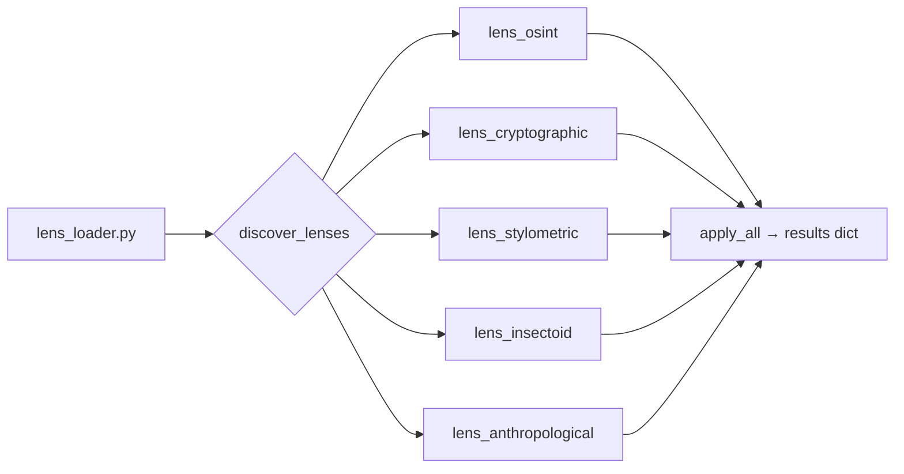

<div align="right">


</div>

# additional-lens-profiles

**A polyglot agent-tooling monorepo: the VOLUME Master EPUB3 splitter, the dynamic lens-profile analysis framework, ARC-AGI swarm orchestration on NVIDIA NIM, IPTV/Stremio discovery, and benchmark baselines — one repo, many sharp tools.**

> **Why should I care?** Instead of five repos you have to remember, this is one workshop: split course EPUBs for LMS delivery, run pluggable "lens" analyzers (OSINT, cryptographic, stylometric…) over arbitrary data, orchestrate agent swarms, and diff against benchmark baselines. Each component is self-contained — use one, ignore the rest.

## Components

| Component | Path | What it does |
|---|---|---|
| **VOLUME Master 2.0** | `src/volume/` | Modular EPUB3 splitter — async musepool chapter processing, MCP skills, agentic optimization for LMS delivery |
| **Lens profiles** | `lens_*.py`, `lens-profiles/` | Dynamic analysis framework — lenses auto-discovered at runtime, each exposing `name` + `analyze` |
| **ARC-AGI swarm** | `src/nvidia_swarm/`, `swarm_*.py` | Hyper-modular NVIDIA-NIM agent orchestration (core, agents, transport) |
| **IPTV discovery** | `src/iptv_discovery/`, `iptv_stremio_discovery.py` | IPTV/Stremio source discovery and deep scanning |
| **Benchmarks** | `src/benchmarks/`, `benchmark_references.py` | Benchmark reference data and baselines |
| **Deobfuscation** | `ast_deobfuscator.py`, `mtime_obfuscation_analyzer.py` | AST-level deobfuscation and mtime-obfuscation analysis |
| **Case study** | `case-study-01-groq-deprecation/` | Groq deprecation case study |
| **Musepool / MCP / skills** | `src/musepool/`, `src/mcp/`, `src/skills/` | Async process-pool engine, MCP integrations, skill patterns |

## How the lens framework works



Drop a new `lens_*.py` next to the loader — no registration, no hardcoded list. Any class with a `name` attribute and an `analyze` method is picked up automatically.

## Quick start

```bash
pip install -e ".[all]"

# Split an EPUB into LMS-ready volumes
volume split --input textbook.epub --max-mb 45 --output ./volumes/

# Run every lens over a data file
python lens_loader.py
```

## Architecture

See [`docs/ARCHITECTURE.md`](docs/ARCHITECTURE.md) for the full map, [`docs/API.md`](docs/API.md) for interfaces, and [`docs/BENCHMARK_BASELINES.md`](docs/BENCHMARK_BASELINES.md) for baseline numbers. `REPO_MANIFEST.json` is the machine-readable inventory of the tree. The agentic pipeline pattern (Researcher → Optimizer → Validator → Publisher) is documented per-component.

Helper scripts live in `scripts/` (`setup.sh`, `build.sh`, `benchmark.sh`, `push.sh`).

## Config

- Python **≥ 3.12** (`pyproject.toml`, hatchling build backend)
- Install extras with `pip install -e ".[all]"` (see `requirements.txt`)
- `bootstrap.py` and `install_persist.sh` handle environment setup

## Dev / contributing

Tests: `tests/unit` + `tests/integration`. The `MAXIMAL_*.md` files capture maximal-spec writeups per agent role (analyst, architect, complex coder, proof writer). Prior-art credits live in [`CREDITS.md`](CREDITS.md) — borrowed patterns are attributed with their licenses there.

## License + security

**MIT** — see [LICENSE](LICENSE).

Security: this repo contains OSINT and deobfuscation tooling. The lens and discovery modules can make network requests — run them in a sandboxed environment, review any lens before pointing it at untrusted data, and never commit API keys or credentials (use environment variables).
